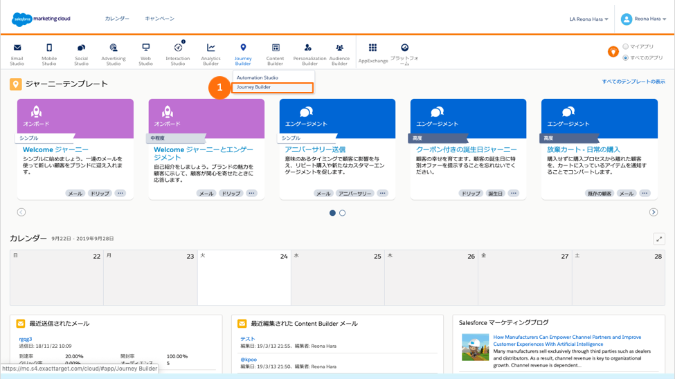
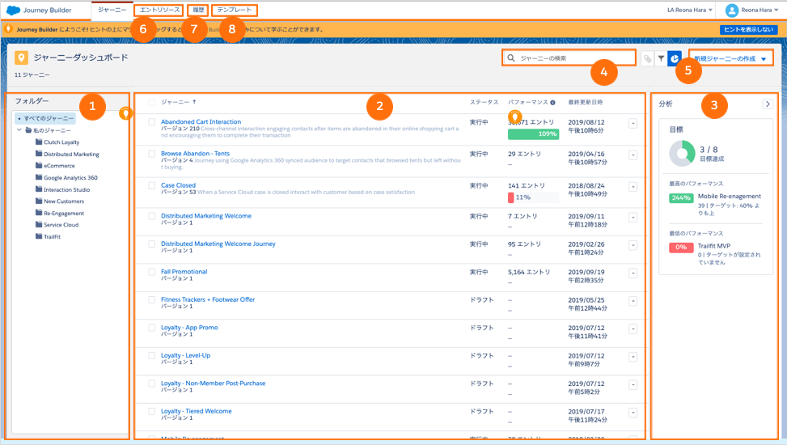
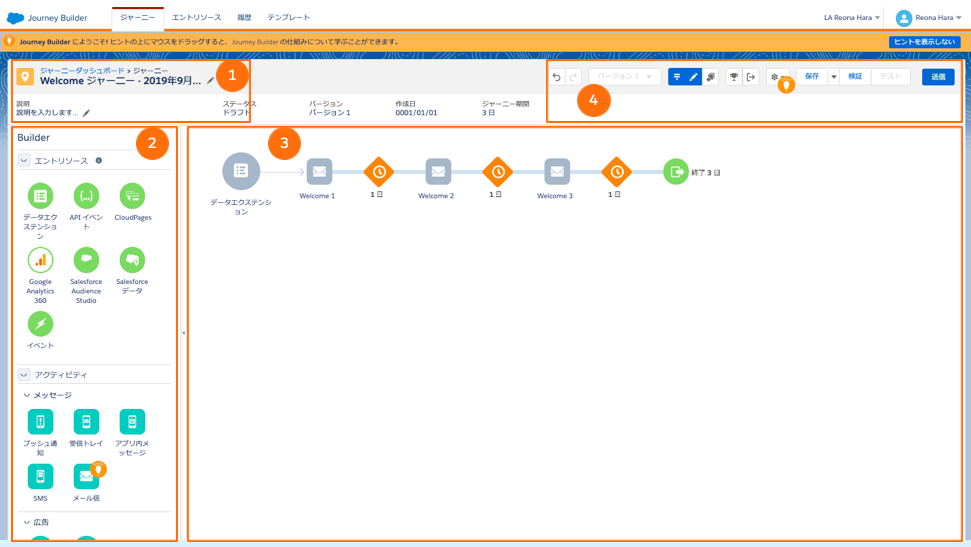

# Hướng dẫn sử dụng Journey Builder trong Salesforce Marketing Cloud

[Quay lại Marketing Cloud Engagement Tips!](sfmc.md)

---

## Journey Builder là gì?

Journey Builder là công cụ giúp bạn **tự động hóa trải nghiệm của từng khách hàng** theo cách cá nhân hóa. Bạn có thể định nghĩa trước:

- Luồng trải nghiệm của khách hàng (từ bước đầu đến bước cuối)
- Điều kiện rẽ nhánh dựa theo hành vi hoặc thuộc tính của khách hàng
- Điều kiện hoàn thành hoặc kết thúc hành trình

---

## Automation Studio vs Journey Builder — Khác nhau như thế nào?

| | Automation Studio | Journey Builder |
|---|---|---|
| **Mục đích** | Tự động hóa các tác vụ vận hành của hệ thống | Tự động hóa trải nghiệm theo hành trình khách hàng |
| **Góc nhìn** | Góc nhìn của người vận hành | Góc nhìn của khách hàng |
| **Ví dụ** | Import dữ liệu, gửi email hàng loạt theo lịch | Gửi email chào mừng → chờ 3 ngày → gửi ưu đãi nếu chưa mua |

---

## Bước 1 — Truy cập Journey Builder

Vào menu: **Journey Builder > Journey Builder**



---

## Bước 2 — Làm quen với màn hình tổng quan



Màn hình chính gồm các khu vực sau:

1. **Thư mục Journey** — Lưu trữ các journey theo thư mục bạn tự tạo để dễ quản lý.
2. **Danh sách Journey** — Xem toàn bộ journey trong từng thư mục, bao gồm trạng thái (đang chạy hay không), hiệu suất, và lần chỉnh sửa gần nhất.
3. **Phân tích (Analytics)** — Xem bao nhiêu journey đang đạt mục tiêu, journey nào hiệu quả nhất và kém nhất.
4. **Tìm kiếm Journey** — Tìm nhanh journey theo tên.
5. **Tạo Journey mới** — Bắt đầu tạo một journey mới từ đây.
6. **Entry Source** — Xem các nguồn dữ liệu đầu vào đang được dùng trong các journey.
7. **Lịch sử (History)** — Theo dõi trạng thái hành trình của từng contact cụ thể.
8. **Template** — Dùng các journey mẫu có sẵn từ Salesforce hoặc từ người dùng khác.

---

## Bước 3 — Hiểu giao diện tạo/chỉnh sửa Journey



Khi mở một journey, bạn sẽ thấy 4 thành phần chính:

1. **Tên & mô tả Journey** — Đặt tên và mô tả để dễ phân biệt.
2. **Entry Source & Activity** — Chọn nguồn dữ liệu đầu vào và các hoạt động trong hành trình (gửi email, chờ, rẽ nhánh...).
3. **Canvas** — Khu vực thiết kế hành trình bằng cách kéo thả các bước.
4. **Toolbar** — Thanh công cụ hỗ trợ thao tác nhanh trên canvas.

---

## Ví dụ thực tế: Xây dựng Welcome Series cho khách hàng mới

### Mô tả Scenario

> Khi một khách hàng **đăng ký tài khoản mới** trên website, hệ thống tự động kích hoạt một chuỗi email chào mừng. Nếu sau 3 ngày khách hàng chưa mua hàng, gửi thêm email ưu đãi. Nếu sau thêm 5 ngày vẫn chưa mua, gửi email nhắc nhở cuối cùng.

**Sơ đồ hành trình:**

```
[Đăng ký tài khoản]
        ↓
[Email: Chào mừng bạn!]
        ↓
   [Chờ 3 ngày]
        ↓
[Decision Split: Đã mua hàng chưa?]
    ↙           ↘
  [CÓ]          [CHƯA]
    ↓               ↓
[Email: Cảm ơn]  [Email: Ưu đãi 10%]
    ↓               ↓
 [Kết thúc]    [Chờ 5 ngày]
                    ↓
          [Decision Split: Đã mua chưa?]
              ↙           ↘
            [CÓ]          [CHƯA]
              ↓               ↓
           [Kết thúc]  [Email: Nhắc nhở cuối]
                            ↓
                         [Kết thúc]
```

---

### Bước 1 — Chuẩn bị dữ liệu đầu vào (Entry Source)

Trước khi tạo journey, bạn cần có một **Data Extension** chứa danh sách khách hàng mới. Trong ví dụ này, DE có tên `New_Subscribers` với các trường:

| Trường | Kiểu dữ liệu | Ghi chú |
|---|---|---|
| `SubscriberKey` | Text | Khóa định danh khách hàng |
| `EmailAddress` | EmailAddress | Địa chỉ email |
| `FirstName` | Text | Tên khách hàng |
| `SignupDate` | Date | Ngày đăng ký |
| `HasPurchased` | Boolean | Đã mua hàng chưa (true/false) |

> **Lưu ý:** Trường `HasPurchased` cần được cập nhật liên tục từ hệ thống CRM hoặc thông qua Automation Studio để Journey Builder có thể kiểm tra chính xác.

---

### Bước 2 — Tạo các Email cần thiết trong Content Builder

Trước khi thiết kế journey, hãy tạo sẵn 4 email sau trong **Content Builder**:

| Tên Email | Mục đích |
|---|---|
| `Welcome - Chào mừng bạn đến với chúng tôi` | Gửi ngay khi đăng ký |
| `Welcome - Cảm ơn bạn đã mua hàng` | Dành cho khách đã mua sau 3 ngày |
| `Welcome - Ưu đãi 10% cho bạn` | Dành cho khách chưa mua sau 3 ngày |
| `Welcome - Đừng bỏ lỡ cơ hội này` | Nhắc nhở cuối, chưa mua sau 8 ngày |

---

### Bước 3 — Tạo Journey mới

1. Vào **Journey Builder > Journey Builder**
2. Nhấn **+ New Journey**
3. Chọn **Multi-Step Journey**
4. Đặt tên journey: `Welcome Series - Khách hàng mới`
5. Nhấn **Create**

---

### Bước 4 — Thiết lập Entry Source

1. Trên canvas, nhấn vào ô **"Set an Entry Source"**
2. Chọn **Data Extension**
3. Tìm và chọn DE `New_Subscribers`
4. Cấu hình như sau:
   - **Run**: `As contacts are added` (chạy mỗi khi có contact mới được thêm vào DE)
   - **Re-entry**: `No re-entry` (mỗi khách hàng chỉ đi qua journey một lần)
5. Nhấn **Save**

---

### Bước 5 — Thêm Email chào mừng đầu tiên

1. Nhấn dấu **+** dưới Entry Source trên canvas
2. Chọn **Messages > Email**
3. Nhấn **Select Email**, tìm và chọn email `Welcome - Chào mừng bạn đến với chúng tôi`
4. Chọn **Sender Profile** và **Reply Mail Management** phù hợp
5. Nhấn **Save**

> Email này sẽ được gửi **ngay lập tức** khi contact vào journey.

---

### Bước 6 — Thêm bước Chờ (Wait)

1. Nhấn **+** dưới bước Email vừa tạo
2. Chọn **Flow Control > Wait**
3. Chọn **Wait by Duration**
4. Thiết lập: **3 Days**
5. Nhấn **Save**

---

### Bước 7 — Thêm Decision Split (Rẽ nhánh đầu tiên)

1. Nhấn **+** dưới bước Wait
2. Chọn **Flow Control > Decision Split**
3. Đặt tên split: `Đã mua hàng sau 3 ngày?`
4. Cấu hình **Path 1 (Đã mua)**:
   - Nhấn vào **Path 1**, đổi tên thành `Đã mua`
   - Nhấn **Add Criteria**
   - Chọn attribute: `HasPurchased`
   - Operator: `Equal`
   - Value: `True`
5. **Path 2** tự động trở thành `Otherwise` (tức là chưa mua) — đổi tên thành `Chưa mua`
6. Nhấn **Save**

---

### Bước 8 — Thiết lập nhánh "Đã mua"

1. Trên nhánh **Đã mua**, nhấn **+**
2. Chọn **Messages > Email**
3. Chọn email `Welcome - Cảm ơn bạn đã mua hàng`
4. Nhấn **Save**

Sau email này, contact sẽ **kết thúc journey** — không cần thêm bước gì thêm.

---

### Bước 9 — Thiết lập nhánh "Chưa mua"

1. Trên nhánh **Chưa mua**, nhấn **+**
2. Chọn **Messages > Email**
3. Chọn email `Welcome - Ưu đãi 10% cho bạn`
4. Nhấn **Save**
5. Nhấn **+** dưới email vừa thêm
6. Chọn **Flow Control > Wait**, thiết lập **5 Days**
7. Nhấn **Save**

---

### Bước 10 — Thêm Decision Split thứ hai

1. Nhấn **+** dưới bước Wait 5 ngày
2. Chọn **Flow Control > Decision Split**
3. Đặt tên: `Đã mua hàng sau 8 ngày?`
4. Cấu hình tương tự Bước 7:
   - **Path 1**: `Đã mua` → điều kiện `HasPurchased = True`
   - **Path 2**: `Vẫn chưa mua`
5. Nhấn **Save**

**Trên nhánh "Đã mua":** Để trống — contact kết thúc journey.

**Trên nhánh "Vẫn chưa mua":**
1. Nhấn **+**, chọn **Messages > Email**
2. Chọn email `Welcome - Đừng bỏ lỡ cơ hội này`
3. Nhấn **Save**

---

### Bước 11 — Thiết lập Goal (Mục tiêu) cho Journey

Goal giúp SFMC xác định khi nào contact đã "hoàn thành" mục tiêu và thoát khỏi journey sớm hơn.

1. Nhấn vào biểu tượng **Goal** trên thanh toolbar phía trên canvas
2. Chọn **Define Goal**
3. Thêm điều kiện: `HasPurchased = True`
4. **Goal Location**: `Anywhere in the journey` — contact sẽ thoát ngay khi đã mua, dù đang ở bước nào
5. Nhấn **Save**

---

### Bước 12 — Kiểm tra và Kích hoạt Journey

1. Nhấn **Validate** (biểu tượng dấu tích trên toolbar) để SFMC kiểm tra xem có lỗi nào không
2. Sửa các lỗi nếu có (thường gặp: email chưa được approve, thiếu sender profile)
3. Nhấn **Activate** để kích hoạt journey
4. Chọn ngày giờ bắt đầu (hoặc chạy ngay lập tức)
5. Xác nhận bằng cách nhấn **Activate** lần cuối

---

### Kết quả kỳ vọng

| Nhóm khách hàng | Hành trình |
|---|---|
| Đăng ký → Mua trong 3 ngày đầu | Nhận email chào mừng → Goal triggered → Thoát sớm |
| Đăng ký → Chưa mua sau 3 ngày → Mua sau khi nhận ưu đãi | Chào mừng → Ưu đãi → Goal triggered → Thoát |
| Đăng ký → Không mua sau 8 ngày | Chào mừng → Ưu đãi → Nhắc nhở cuối → Kết thúc |

---

## Tài liệu tham khảo

- [Salesforce Help: Get Started with Journey Builder](https://help.salesforce.com/articleView?id=mc_jb_get_started_with_journey_builder.htm&type=5)
