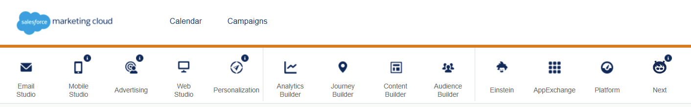

# Salesforce Marketing Cloud — Hướng dẫn

## Mục lục

- [Cách tạo SQL Query](#cách-tạo-sql-query)
- [Cách tạo Data Extension](#cách-tạo-data-extension)
- [Cách thêm Attribute vào Data Extension](#cách-thêm-attribute-vào-data-extension)
- [Cách tạo Email Template](#cách-tạo-email-template)

---

## Cách tạo SQL Query

## Bước 1: Mở Automation Studio

1. Đăng nhập vào Marketing Cloud.
2. Ở thanh menu trên cùng, hover vào **Journey Builder**.
3. Trong dropdown, chọn **Automation Studio**.

## Bước 2: Mở danh sách SQL Query

1. Trong Automation Studio, nhìn lên thanh tab phía trên và chọn **Activities**.
2. Ở danh sách bên trái, chọn **SQL Query**.

## Bước 3: Tạo hoặc chỉnh sửa SQL Query

- **Tạo mới:** Nhấn **Create Activity**.
- **Chỉnh sửa:** Chọn SQL Query có sẵn trong danh sách, rồi nhấn vào để mở và sửa.

---

## Cách tạo Data Extension

Data Extension là bảng lưu trữ dữ liệu (contact, subscriber, v.v.) trong Marketing Cloud.

### Bước 1: Mở Email Studio

1. Đăng nhập vào Marketing Cloud.
2. Hover vào **Email Studio** trên thanh menu.
3. Chọn **Email Studio** trong dropdown.

### Bước 2: Vào Subscribers > Data Extensions

1. Trong menu bên trái, chọn **Subscribers**.
2. Chọn **Data Extensions**.

### Bước 3: Tạo Data Extension mới

1. Nhấn **Create** ở góc trên bên phải.
2. Chọn kiểu tạo:
   - **Standard Data Extension** — tạo thủ công từ đầu.
   - **From Existing** — sao chép cấu trúc từ Data Extension khác.
   - **From Template** — dùng template có sẵn.
3. Điền thông tin:
   - **Name:** Tên Data Extension.
   - **External Key:** Tự động điền, có thể đổi nếu cần.
   - **Description:** Mô tả (tuỳ chọn).
4. Nhấn **Next**, sau đó thêm các **Fields** (cột dữ liệu):
   - Nhấn **Add** để thêm field.
   - Điền **Name**, chọn **Data Type** (Text, Number, Date, Boolean, v.v.), đặt độ dài nếu cần.
   - Đánh dấu **Primary Key** cho field dùng làm khoá chính.
5. Nhấn **Create** để lưu.

---

## Cách thêm Attribute vào Data Extension

Attribute (hay Field) là các cột dữ liệu trong Data Extension, ví dụ: `Email`, `FirstName`, `DateOfBirth`.

### Bước 1: Mở Data Extension cần chỉnh sửa

1. Vào **Email Studio** > **Subscribers** > **Data Extensions**.
2. Tìm và nhấn vào tên Data Extension muốn thêm attribute.

### Bước 2: Vào tab Fields

1. Trong trang chi tiết của Data Extension, chọn tab **Fields**.
2. Danh sách các attribute hiện có sẽ hiển thị ở đây.

### Bước 3: Thêm Attribute mới

1. Nhấn **Add Field** (hoặc **Add Attribute**).
2. Điền thông tin cho attribute:

| Thuộc tính | Mô tả |
|---|---|
| **Name** | Tên field, không có dấu cách (dùng `_` nếu cần, ví dụ `First_Name`) |
| **Data Type** | Kiểu dữ liệu (xem bảng bên dưới) |
| **Length** | Độ dài tối đa (chỉ áp dụng cho Text) |
| **Default Value** | Giá trị mặc định nếu không có dữ liệu (tuỳ chọn) |
| **Required** | Bắt buộc nhập dữ liệu hay không |
| **Primary Key** | Đánh dấu nếu field này là khoá chính (dùng để định danh bản ghi) |

### Các Data Type phổ biến

| Data Type | Dùng cho |
|---|---|
| **Text** | Chuỗi ký tự (tên, email, mã...) |
| **Number** | Số nguyên |
| **Decimal** | Số thập phân |
| **Date** | Ngày tháng |
| **Boolean** | Đúng/Sai (`True`/`False`) |
| **EmailAddress** | Địa chỉ email (có validation tự động) |
| **Phone** | Số điện thoại |
| **Locale** | Mã ngôn ngữ/vùng (ví dụ `en-US`) |

### Bước 4: Lưu

1. Sau khi điền đầy đủ, nhấn **Save** để lưu attribute mới.
2. Attribute sẽ xuất hiện trong danh sách Fields của Data Extension.

> **Lưu ý:** Không thể thay đổi **Data Type** của attribute sau khi đã có dữ liệu. Hãy xác định đúng kiểu dữ liệu từ đầu.

---

## Cách tạo Email Template

Email Template là mẫu email tái sử dụng, giúp thiết kế nhất quán và tiết kiệm thời gian.

### Bước 1: Mở Content Builder

1. Đăng nhập vào Marketing Cloud.
2. Hover vào **Content Builder** trên thanh menu.
3. Chọn **Content Builder** trong dropdown.

### Bước 2: Tạo Template mới

1. Nhấn **Create** ở góc trên bên phải.
2. Chọn **Template**.

### Bước 3: Chọn phương thức thiết kế

- **Drag and Drop** — kéo thả các block nội dung, phù hợp người mới.
- **HTML Paste** — dán code HTML trực tiếp, phù hợp người có kỹ thuật.
- **From Existing** — tạo dựa trên template đã có.

### Bước 4: Thiết kế nội dung

1. Đặt tên template ở ô **Template Name**.
2. Kéo thả các block (Image, Text, Button, v.v.) vào vùng thiết kế.
3. Click vào từng block để chỉnh nội dung, font, màu sắc.
4. Dùng **Preview** để xem trước giao diện trên desktop và mobile.

### Bước 5: Lưu Template

1. Nhấn **Save** ở góc trên bên phải.
2. Template sẽ xuất hiện trong thư mục Content Builder, sẵn sàng dùng khi tạo email.
